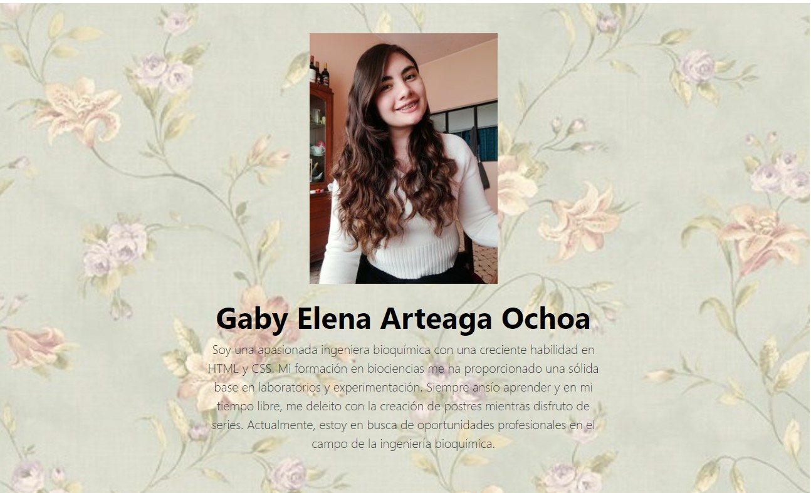
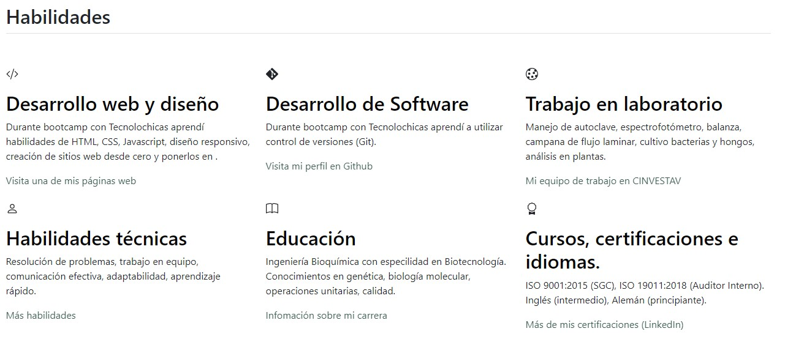
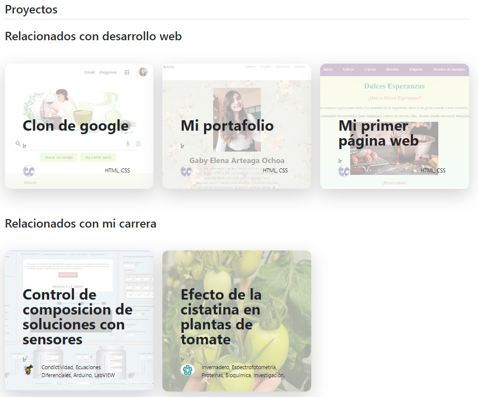
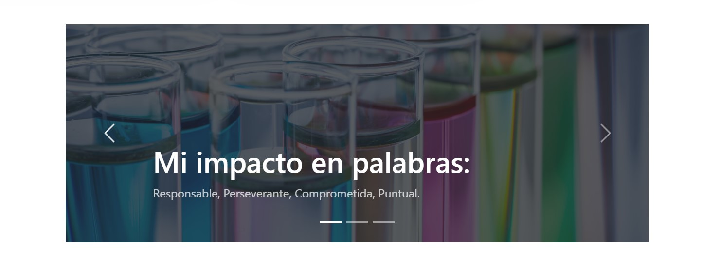
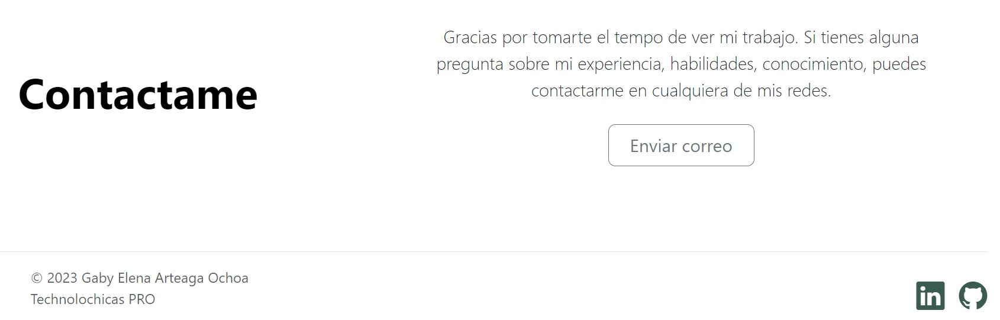

# Portafolio personal: Tecnolochicas PRO

Este proyecto fue creado durante el bootcamp Technolochicas PRO, es una página web responsiva (adaptable a diversos dispositivos).

El propósito de la creación de este sitio web es mostrar el portafolio de proyectos de la desarrolladora y su experiencia al rededor del área. 

Incluye las secciones: sobre mi, habilidades, proyectos, testimonios y contacto.

Incluye recusrsos multimedia
<a href="https://funny-twilight-d72dc4.netlify.app" target="_blank">Visit Now 🚀 </a>

# Secciones (Capturas de pantalla)
  
 **Sobre Mí**: Una breve introducción sobre mí, mis estudios, conocimientos y mi experiencia.

 **Habilidades**: Lista de mis habilidades técnicas y profesionales.
 
 **Proyectos**: Se muestran proyectos destacados realizados durante el bootcamp de Tecnolochicas PRO. Además algunos proyectos destacados que desarrolle relacionados con mi parte de Ingeniera Bioquímica.

 **Testimonios**: Comentarios de compañeros y mentores.
 
 **Contacto**: Información de contacto.

  # Tecnologías

## Agradecimientos

Agradezco a Tecnolochicas PRO, Santander, Fundación Televisa y Microsoft por la beca proporcionada, por su apoyo y mentoría a Malinali y Anel, que siempre estuvieron para apoyarme en el desarrollo de este proyecto.

## Contacto

Si estás interesado en compartir o contactar para algun proyecto u oportunidad laboral, contáctame. 

<a href="https://www.linkedin.com/in/gaby-elena-arteaga-ochoa/"></img></a>

© 2023 Gaby Arteaga 