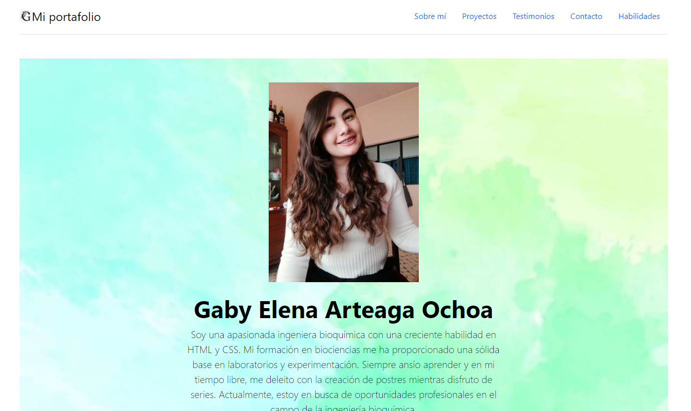

# Portafolio personal: Tecnolochicas PRO

Este proyecto fue creado durante el bootcamp Technolochicas PRO, es una página web responsiva (adaptable a diversos dispositivos).

El propósito de la creación de este sitio web es mostrar el portafolio de proyectos de la desarrolladora y su experiencia al rededor del área. 

Incluye las secciones: sobre mi, proyectos, experiencia.

Incluye recusrsos multimedia
<a href="https://funny-twilight-d72dc4.netlify.app" target="_blank">Visit Now 🚀 :eyes: </a>

## Índice
1. Intro
2. Demo
3. ¿Qué construímos?
4. Objetivos de aprendizaje
5. Requerimientos

# Secciones (Capturas de pantalla)
 Sobre mi 
 
 
  # Tecnologías

## Contacto

Si estás interesado en compartir o contactar para algun proyecto u oportunidad laboral, contáctame. 

<a href="https://www.linkedin.com/in/gaby-elena-arteaga-ochoa/"></img></a>

© 2023 Gaby Arteaga 